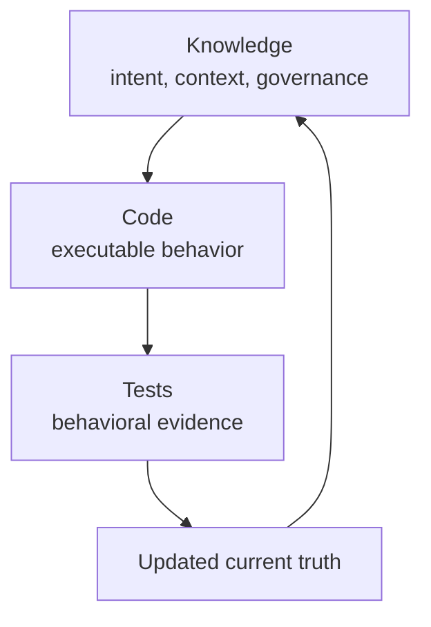

# The Three Pillars of DevSpark

DevSpark makes AI-assisted software development easier to understand, verify,
and continue. It connects three concerns that are often separated in software
projects: **Knowledge**, **Code**, and **Tests**.

Together, they define a change that is ready to become part of the system's
current truth.



## Why three pillars?

AI agents can produce code quickly, but speed does not solve lost context,
ambiguous requirements, or weak verification. A reliable development system
must make the relationship between intent, implementation, and evidence
explicit.

DevSpark treats a change as incomplete when any connection is missing:

- Knowledge without code describes an aspiration rather than a working system.
- Code without knowledge is difficult to govern, explain, or extend.
- Tests without either context may pass while checking the wrong behavior.

## Knowledge: current truth

Knowledge records what is true now and why it is true. DevSpark stores durable
knowledge under `.knowledge/`, including architecture and system entities,
governance principles, current decisions, ontology metadata, relationships, and
product documentation.

Temporary specifications, plans, tasks, and review artifacts remain in
`.devspark.work/` while work is in progress. They explain how a change is being
produced; they do not become permanent product knowledge. This keeps the
permanent repository useful without requiring a future agent to reconstruct old
lifecycle history.

Knowledge also tells an agent which rules apply. DevSpark requires evidence for
durable claims, prohibits permanent references to ephemeral work, and expects
code, tests, and knowledge to remain linked.

## Code: executable intent

Code turns intent into behavior. In DevSpark, the code pillar includes more than
application source code. DevSpark is a prompt-first toolkit whose executable
product surface includes lifecycle prompts, agent shims, portable skills,
deterministic Bash and PowerShell helpers, schemas, and release behavior.

The lifecycle makes those responsibilities explicit:

```text
specify → plan → tasks → gates → implement → verify → review → release
```

Implementation applies code and durable knowledge together. Completed tasks
record `code_ref`, `test_ref`, and `knowledge_ref`, so the result remains
traceable without making permanent documentation depend on temporary work
packages.

## Tests: behavioral evidence

Tests turn claims into evidence. DevSpark prefers execution evidence whenever a
test can reasonably assert the claim. Inspection evidence is allowed when
execution is impractical, but the fallback and its reason must be recorded.

DevSpark also applies Genuine Fix Discipline: improved coverage, lower lint
counts, or better complexity scores are supporting signals, not proof of a
behavioral fix. The behavior named by the requirement, task, or review finding
must be demonstrated first.

The repository tests the development system as well as its scripts. Its
contracts cover prompt structure, knowledge schemas, ontology freshness,
Bash/PowerShell parity, work-package linkage, release boundaries, review
resolution, and skill packaging.

## How the pillars work together

Consider a feature such as email notifications:

1. **Knowledge** records the user outcome, delivery constraints, and governing
   decisions.
2. **Code** implements notification behavior using the repository's patterns.
3. **Tests** prove delivery, failure handling, and the intended user outcome.
4. **Knowledge** is updated so the repository describes the new current truth.

Verification checks both behavioral proof and current-truth integrity. Release
then revalidates the landed change and archives the completed work package. A
passing test is important, but it is not the same as complete assimilation.

## Start with the pillars

- Use `constitution`, `discover-knowledge`, `explain`, and `repo-story` to
  understand and maintain Knowledge.
- Use `specify`, `plan`, `tasks`, `implement`, and `create-pr` to turn intent
  into Code.
- Use `checklist`, `analyze`, `critic`, `verify`, `pr-review`, and `release` to
  produce and evaluate Tests and other evidence.

Know what should be true, implement it clearly, prove that it works, and update
the knowledge so the next change starts from reality.
