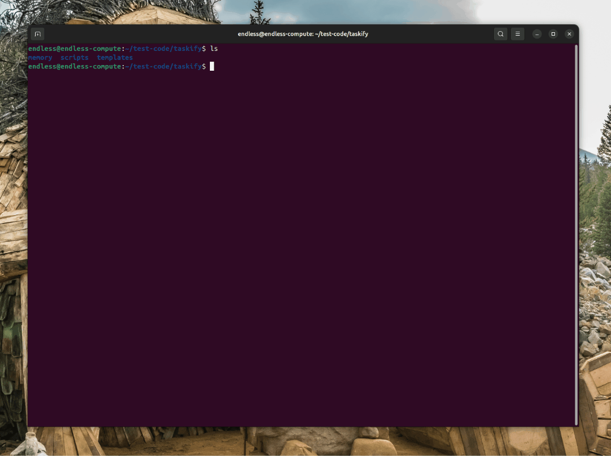

<div align="center">
    
    <h1>DevSpark</h1>
    <h3><em>A structured development process for AI coding assistants.<br/>Just markdown files — no install required.</em></h3>
</div>

<p align="center">
    <strong>DevSpark is a set of 21 prompt templates + helper scripts that give any AI coding assistant a repeatable workflow — from requirements through release. Copy them into your project and go. Works with Claude, Copilot, Cursor, Gemini, and 13 more.</strong>
</p>

<p align="center">
    <a href="https://github.com/markhazleton/devspark/actions/workflows/release.yml"></a>
    <a href="https://github.com/markhazleton/devspark/stargazers"></a>
    <a href="https://github.com/markhazleton/devspark/blob/main/LICENSE"></a>
    <a href="https://markhazleton.github.io/spec-kit/"></a>
</p>

> **Not a program. Not a subscription.** DevSpark is a development *process* — a collection of prompt files and scripts that your AI assistant reads directly. Copy them into your project once and you're off to the races. There's nothing to install, no runtime, no dependencies, and no ongoing updates required. An optional CLI exists to automate the initial setup, but it's not required.

---

## What's In This Repo

### 1. Prompt Templates (`templates/commands/`)

**This is the core of DevSpark** — 21 markdown files that give any AI coding assistant structured slash commands:

| Prompt | Purpose |
|--------|---------|
| [`/devspark.specify`](templates/commands/specify.md) | Define what you want to build (requirements & user stories) |
| [`/devspark.plan`](templates/commands/plan.md) | Create a technical implementation plan |
| [`/devspark.tasks`](templates/commands/tasks.md) | Break the plan into actionable task lists |
| [`/devspark.implement`](templates/commands/implement.md) | Execute all tasks to build the feature |
| [`/devspark.constitution`](templates/commands/constitution.md) | Establish project principles and guidelines |
| [`/devspark.pr-review`](templates/commands/pr-review.md) | Constitution-based pull request review |
| [`/devspark.site-audit`](templates/commands/site-audit.md) | Comprehensive codebase audit |
| [`/devspark.quickfix`](templates/commands/quickfix.md) | Lightweight workflow for bug fixes |
| [`/devspark.harvest`](templates/commands/harvest.md) | Clean stale docs and archive obsolete artifacts |
| [`/devspark.release`](templates/commands/release.md) | Archive dev artifacts and prepare releases |
| [`/devspark.evolve-constitution`](templates/commands/evolve-constitution.md) | Propose constitution amendments |
| [`/devspark.repo-story`](templates/commands/repo-story.md) | Generate narrative from commit history |
| [`/devspark.critic`](templates/commands/critic.md) | Adversarial risk analysis before implementation |
| _...and more_ | `clarify`, `analyze`, `checklist`, `personalize`, `archive`, `upgrade`, `discover-constitution` |

### 2. Helper Scripts (`scripts/`)

PowerShell + Bash scripts that gather project context (git history, file structure, dependencies) for the prompts to consume. Not required but improve prompt quality.

### 3. Optional CLI (`src/devspark_cli/`)

A convenience tool that copies the prompts, scripts, and agent config into your project in one command. **You do not need this to use DevSpark.**

```text
devspark/
├── templates/          ← THE PROMPTS (start here)
│   └── commands/       ← 21 slash-command prompt files
├── scripts/            ← Context-gathering scripts (PowerShell + Bash)
├── src/devspark_cli/   ← Optional CLI source code
├── .documentation/     ← Docs, guides, media, and GitHub Pages site
└── (standard community files: README, LICENSE, CHANGELOG, etc.)
```

### Customization Without Risk

DevSpark uses a **3-tier override system** so you never lose your work when upgrading:

```text
Resolution order (first match wins):
1. .documentation/{git-user}/commands/   ← Your personal tweaks
2. .documentation/commands/              ← Your team's customizations
3. .documentation/defaults/commands/     ← Stock DevSpark (upgrades write here only)
```

Copy once, customize freely. Upgrades only touch `defaults/` — your team and personal customizations always win.

---

## Table of Contents

- [What's In This Repo](#whats-in-this-repo)
- [Three Pillars](#three-pillars)
- [🎯 The ASLCD Vision](#-the-aslcd-vision)
- [🤔 What is Spec-Driven Development?](#-what-is-spec-driven-development)
- [⚡ Get Started](#-get-started)
- [📽️ Video Overview](#️-video-overview)
- [🤖 Supported AI Agents](#-supported-ai-agents)
- [🔧 DevSpark CLI Reference](#-devspark-cli-reference)
- [📚 Core Philosophy](#-core-philosophy)
- [🌟 Development Phases](#-development-phases)
- [🗺️ Roadmap](#️-roadmap)
- [🔧 Prerequisites](#-prerequisites)
- [📖 Learn More](#-learn-more)
- [📋 Detailed Process](#-detailed-process)
- [🔍 Troubleshooting](#-troubleshooting)
- [👥 Maintainers](#-maintainers)
- [💬 Support](#-support)
- [🙏 Acknowledgements](#-acknowledgements)
- [📄 License](#-license)

---

## Three Pillars

DevSpark is built on three reinforcing design principles:

### 🔀 Agent-Agnostic by Default

Every AI coding assistant is a first-class citizen. Canonical command prompts live in `.documentation/commands/` — a single source of truth — while each platform (`.claude/`, `.github/`, `.cursor/`, `.gemini/`, etc.) receives only thin shims that redirect to the canonical content. Switch agents, use multiple agents on the same project, or onboard new team members on different tools — the workflow stays the same.

### 👥 Multi-User Personalization

Teams share a common set of prompts, but individuals can customize any command without affecting others. Run `/devspark.personalize specify` to create a user-scoped override in `.documentation/{git-user}/commands/`. Personalized prompts are committed to git so the team can review and share customizations. Delete the override to revert to the shared default.

### 🔄 Full Lifecycle Coverage

From greenfield project creation (`/devspark.specify`) through brownfield discovery (`/devspark.discover-constitution`), ongoing maintenance (`/devspark.quickfix`), documentation cleanup (`/devspark.harvest`), release management (`/devspark.release`), and constitution evolution (`/devspark.evolve-constitution`) — DevSpark supports every phase of the software development lifecycle, not just the initial build.

---

## 🎯 The ASLCD Vision

**Adaptive System Life Cycle Development** extends traditional spec-driven development to address real-world challenges that the original approach doesn't fully cover:

| Challenge | Traditional Approach | ASLCD Solution |
|-----------|---------------------|----------------|
| **Greenfield Bias** | Works well for new projects | `/devspark.discover-constitution` generates constitutions from existing code |
| **Task Overhead** | Full spec workflow for everything | `/devspark.quickfix` provides lightweight workflow for bug fixes |
| **Documentation Drift** | Specs accumulate and become stale | `/devspark.release` archives artifacts and maintains living docs |
| **Repo Clutter** | AI-generated docs and stale drafts accumulate | `/devspark.harvest` consolidates knowledge and archives obsolete artifacts |
| **Constitution Staleness** | No formal update process | `/devspark.evolve-constitution` proposes amendments from findings |
| **Context Management** | Same context for all tasks | Right-sized workflows optimize AI agent effectiveness |

### Design Principles

1. **Universality over Opinion** - Core prompts that adapt rather than single-use commands
2. **Right-Sized Rigor** - Match process overhead to task complexity
3. **Continuous Compliance** - Constitution validation throughout the lifecycle
4. **Adaptive Evolution** - Systems and documentation evolve together

### Workflow Selection

```text
┌─────────────────────────────────────────┐
│           Task Arrives                   │
└─────────────────┬───────────────────────┘
                  │
    ┌─────────────┼─────────────┐
    ▼             ▼             ▼
┌────────┐  ┌──────────┐  ┌──────────┐
│Bug Fix │  │ Minor    │  │ Major    │
│Hotfix  │  │ Feature  │  │ Feature  │
└───┬────┘  └────┬─────┘  └────┬─────┘
    │            │             │
    ▼            ▼             ▼
┌────────┐  ┌──────────┐  ┌──────────┐
│quickfix│  │ quickfix │  │ specify  │
│        │  │   OR     │  │ plan     │
│        │  │ specify  │  │ tasks    │
└────────┘  └──────────┘  └──────────┘
```

**[Full ASLCD Documentation](./.documentation/adaptive-lifecycle.md)** | **[Roadmap](./.documentation/roadmap.md)**

---

## 🤔 What is Spec-Driven Development?

Spec-Driven Development **flips the script** on traditional software development. For decades, code has been king — specifications were just scaffolding we built and discarded once the "real work" of coding began. Spec-Driven Development changes this: **specifications become executable**, directly generating working implementations rather than just guiding them.

## ⚡ Get Started

**You do NOT need to install anything.** The prompts are markdown files and the scripts are standard PowerShell/Bash — your AI agent reads them directly. Copy once, use forever.

### Option A: Copy and Go (Recommended)

1. Download the latest release zip for your agent from [Releases](https://github.com/markhazleton/devspark/releases) and unzip into your project
2. **Or** clone this repo and copy `templates/commands/` → your project's `.documentation/commands/`, and `scripts/` → `.documentation/scripts/`
3. Configure your agent's shim file (e.g., `CLAUDE.md`, `.github/copilot-instructions.md`) to point at `.documentation/commands/`

That's it — your AI assistant now has the `/devspark.*` commands.

### Option B: Use the CLI (Automated Scaffolding)

The CLI automates Option A — it copies templates, scripts, and agent config into your project in one command:

```bash
# Install the CLI
uv tool install devspark-cli --from git+https://github.com/markhazleton/devspark.git

# Greenfield: Create new project from scratch
devspark init <PROJECT_NAME>

# Brownfield: Add to existing project
cd /path/to/your-existing-project
devspark init --here --ai claude

# Check installed tools
devspark check
```

> **Brownfield Tip**: Use `/devspark.discover-constitution` after initialization to analyze existing code patterns and draft a constitution.

### Upgrading (Optional)

Once you've copied the prompts into your project, they're yours — you can customize them freely and never look back. If you *want* to pull in newer prompt versions later, the CLI can help:

```bash
devspark upgrade                    # Pull latest prompts into your project
devspark upgrade --dry-run          # Preview changes first
devspark upgrade --backup           # Backup constitution before upgrading
```

See the [Upgrade Guide](./.documentation/upgrade.md) for details.

#### One-time Usage (no persistent install)

```bash
uvx --from git+https://github.com/markhazleton/devspark.git devspark init <PROJECT_NAME>
```

### 2. Establish project principles

Launch your AI assistant in the project directory. The `/devspark.*` commands are available in the assistant.

Use the **`/devspark.constitution`** command to create your project's governing principles and development guidelines that will guide all subsequent development.

```bash
/devspark.constitution Create principles focused on code quality, testing standards, user experience consistency, and performance requirements
```

### 3. Create the spec

Use the **`/devspark.specify`** command to describe what you want to build. Focus on the **what** and **why**, not the tech stack.

```bash
/devspark.specify Build an application that can help me organize my photos in separate photo albums. Albums are grouped by date and can be re-organized by dragging and dropping on the main page. Albums are never in other nested albums. Within each album, photos are previewed in a tile-like interface.
```

### 4. Create a technical implementation plan

Use the **`/devspark.plan`** command to provide your tech stack and architecture choices.

```bash
/devspark.plan The application uses Vite with minimal number of libraries. Use vanilla HTML, CSS, and JavaScript as much as possible. Images are not uploaded anywhere and metadata is stored in a local SQLite database.
```

### 5. Break down into tasks

Use **`/devspark.tasks`** to create an actionable task list from your implementation plan.

```bash
/devspark.tasks
```

### 6. Execute implementation

Use **`/devspark.implement`** to execute all tasks and build your feature according to the plan.

```bash
/devspark.implement
```

For detailed step-by-step instructions, see our [comprehensive guide](./.documentation/spec-driven-development.md).

## Constitution-Powered Commands

These commands leverage your project constitution but are **independent of the Spec-Driven Development workflow**. They don't require any spec, plan, or tasks—just a constitution. Use them on any codebase, anytime.

### Site Audit

Use the **`/devspark.site-audit`** command to perform a comprehensive codebase audit against your project constitution and standards:

```bash
# Full audit (default - all checks)
/devspark.site-audit

# Constitution compliance only
/devspark.site-audit --scope=constitution

# Package/dependency analysis only
/devspark.site-audit --scope=packages

# Code quality metrics only
/devspark.site-audit --scope=quality

# Unused code/dependencies detection
/devspark.site-audit --scope=unused

# Duplicate code detection
/devspark.site-audit --scope=duplicate
```

**Key Features**:

- **Constitution-Driven Analysis** - Evaluates codebase against project principles
- **Security Scanning** - Detects hardcoded secrets, insecure patterns, missing validation
- **Dependency Auditing** - Identifies outdated, vulnerable, or unused packages
- **Code Quality Metrics** - Measures complexity, duplication, and maintainability
- **Automated Reports** - Saves detailed audit results to `/.documentation/copilot/audit/YYYY-MM-DD_results.md`
- **Trend Tracking** - Compares results against previous audits for improvement trends

**Prerequisites**:

- Project constitution at `/.documentation/memory/constitution.md`
- PowerShell 7+ (for script execution)
- pip-audit (optional, for Python security scanning)

For complete audit details, see the generated report in `/.documentation/copilot/audit/`.

### Critic (Adversarial Risk Analysis)

Use the **`/devspark.critic`** command to perform adversarial risk analysis identifying technical flaws, implementation hazards, and failure modes:

```bash
# Run critic analysis after tasks are generated
/devspark.critic

# Focus on specific concerns
/devspark.critic Focus on scalability and security risks
```

**Key Features**:

- **Pre-mortem Analysis** - Imagines project failure in production and explains why
- **Stack-Specific Risks** - Detects framework-specific hazards (Python async, Node.js, Go, etc.)
- **Showstopper Detection** - Identifies issues that will cause production outages or security breaches
- **Go/No-Go Recommendation** - Provides clear verdict on whether to proceed with implementation
- **Constitution Violations** - Flags any deviations from project principles as showstoppers

**Severity Levels**:

- **SHOWSTOPPER** - Will cause production outage, data loss, or security breach (blocks implementation)
- **CRITICAL** - Will cause major user-facing issues or costly rework
- **HIGH** - Will cause technical debt or operational burden
- **MEDIUM** - Will slow development or cause minor issues

**When to Use**:

- After `/devspark.tasks` and before `/devspark.implement`
- When you want a skeptical review of your implementation plan
- To identify risks the team may have overlooked

**Key Distinction from `/devspark.analyze`**:

- `/devspark.analyze` = Consistency & completeness checking (are artifacts aligned?)
- `/devspark.critic` = Adversarial risk analysis (what will fail in production?)

**Prerequisites**:

- Project constitution at `/.documentation/memory/constitution.md`
- Completed spec.md, plan.md, and tasks.md in the feature directory (this command is part of the spec workflow)

### Pull Request Review

Use the **`/devspark.pr-review`** command to perform constitution-based code reviews on any GitHub Pull Request:

```bash
# Review current PR (auto-detect from branch)
/devspark.pr-review

# Review specific PR by number
/devspark.pr-review #123

# Re-review after changes
/devspark.pr-review #123
```

**Key Features**:

- **Works for any PR** - not limited to feature branches or spec-driven development
- **Only requires constitution** - no spec, plan, or tasks needed
- **Branch-agnostic** - review PRs targeting main, develop, or any branch
- **Persistent reviews** - saves reports to `/.documentation/specs/pr-review/pr-{number}.md`
- **Tracks changes** - monitors commit SHA and review timestamps
- **Update handling** - appends new reviews when PR changes, preserves history

**Review Output**:

- Constitution compliance evaluation (principle-by-principle)
- Security analysis and checklist
- Code quality assessment
- Testing coverage validation
- Categorized findings (Critical/High/Medium/Low)
- Actionable recommendations with file:line references
- Approval recommendation (Approve/Request Changes/Reject)

**Prerequisites**:

- Project constitution at `/.documentation/memory/constitution.md`
- [GitHub CLI (`gh`)](https://cli.github.com/) installed and authenticated
- GitHub repository with pull requests

For complete usage guide, see [PR Review Documentation](./.documentation/pr-review-usage.md).

### Quickfix (Lightweight Workflow)

Use the **`/devspark.quickfix`** command for rapid bug fixes and small features without the overhead of full specification workflows:

```bash
# Bug fix with auto-classification
/devspark.quickfix fix null pointer exception in UserService.getProfile()

# Urgent hotfix
/devspark.quickfix urgent: payment processing timeout in checkout flow

# Mark as complete
/devspark.quickfix complete QF-2026-001

# List recent quickfixes
/devspark.quickfix list
```

**Key Features**:

- **Auto-Classification** - Detects bug-fix, hotfix, minor-feature, config-change, or docs-update
- **Targeted Validation** - Only checks constitution principles relevant to the task type
- **Lightweight Records** - Creates minimal documentation at `/.documentation/quickfixes/QF-{YYYY}-{NNN}.md`
- **Scope Detection** - Warns when work expands beyond classification limits
- **Completion Tracking** - Links to commits and PRs when marking complete

**When to Use**:

- Single file changes under 50 lines
- Bugs with clear root cause
- Production issues needing rapid response
- Configuration changes

**When to Use Full Spec Instead**:

- Multiple files with architectural impact
- New user-facing features
- Database schema or API contract changes

### Release Documentation

Use the **`/devspark.release`** command to archive development artifacts and prepare for the next development cycle:

```bash
# Auto-calculate version from completed work
/devspark.release

# Explicit version
/devspark.release 2.0.0

# Preview changes without writing
/devspark.release --dry-run
```

**Key Features**:

- **Artifact Archival** - Moves completed specs and quickfixes to `/.documentation/releases/v{VERSION}/`
- **ADR Extraction** - Distills key architectural decisions into permanent documentation
- **CHANGELOG Generation** - Auto-generates changelog entries from completed work
- **Version Calculation** - Determines MAJOR/MINOR/PATCH based on content
- **Clean Slate** - Resets specs directory for next development cycle

**Output**:

- `/.documentation/releases/v{VERSION}/release-notes.md` - Human-readable release summary
- `/.documentation/releases/v{VERSION}/specs/` - Archived specifications
- `/.documentation/releases/v{VERSION}/quickfixes/` - Archived quickfixes
- `/.documentation/decisions/ADR-{NNN}.md` - Architectural Decision Records
- Updated `CHANGELOG.md`

### Harvest Documentation Cleanup

Use the **`/devspark.harvest`** command to clean stale docs, rewrite spec-linked code comments, and archive obsolete artifacts after preserving useful knowledge in living documentation:

```bash
# Full harvest
/devspark.harvest

# Documentation-only review and cleanup plan
/devspark.harvest --scope=docs

# Rewrite stale spec/task references in code comments only
/devspark.harvest --scope=comments

# Dry-run inventory and report only
/devspark.harvest --scope=scan
```

**Key Features**:

- **Knowledge Preservation First** - Updates living docs before archival
- **Documentation Scoring** - Assigns taxonomy, usefulness score, and disposition to scanned artifacts
- **Comment Hygiene** - Rewrites spec-linked comments into self-contained code documentation
- **Safe Archival** - Moves stale content to `/.archive/` with preserved structure
- **Approval Gate** - Presents a harvest plan and requires explicit confirmation before changes

**Output**:

- Updated `CHANGELOG.md` or living docs where knowledge is harvested
- Harvest report at `/.documentation/copilot/harvest-YYYY-MM-DD.md`
- Archived stale docs and completed artifacts under `/.archive/`

**When to Use**:

- After several specs or quickfixes have accumulated supporting docs
- When AI-generated reviews, drafts, or session notes are cluttering the repo
- Before a release or documentation cleanup pass

### Constitution Evolution

Use the **`/devspark.evolve-constitution`** command to analyze PR reviews and propose constitution amendments:

```bash
# Full analysis of PR reviews and audits
/devspark.evolve-constitution

# Analyze specific PR findings
/devspark.evolve-constitution --from-pr #123

# Manual suggestion
/devspark.evolve-constitution suggest "Add principle for API versioning standards"

# Approve a proposal
/devspark.evolve-constitution approve CAP-2026-001

# Reject with reason
/devspark.evolve-constitution reject CAP-2026-002 "Too restrictive for current team"
```

**Key Features**:

- **Pattern Analysis** - Scans PR reviews for recurring violation patterns
- **Gap Detection** - Identifies issues not mapped to existing principles
- **Proposal Generation** - Creates CAP (Constitution Amendment Proposal) documents
- **History Tracking** - Maintains amendment log at `/.documentation/memory/constitution-history.md`
- **Approval Workflow** - Supports approve/reject actions with rationale

**Amendment Types**:

- **ADD** - New principle for uncovered area
- **MODIFY** - Update unclear or incomplete principle
- **DEPRECATE** - Remove or soften outdated principle
- **CLARIFY** - Add examples without changing rules

**Prerequisites**:

- Project constitution at `/.documentation/memory/constitution.md`
- PR review history (recommended for analysis mode)

## 📽️ Video Overview

Want to see DevSpark in action? Watch our [video overview](https://www.youtube.com/watch?v=a9eR1xsfvHg&pp=0gcJCckJAYcqIYzv)!

[](https://www.youtube.com/watch?v=a9eR1xsfvHg&pp=0gcJCckJAYcqIYzv)

## 🤖 Supported AI Agents

DevSpark is **agent-agnostic by design**. Every agent below is a first-class citizen — canonical prompts live in `.documentation/commands/` and each platform receives a thin shim. Switch agents freely, use multiple agents on the same project, or let different team members choose their preferred tool.

| Agent                                                                                | Support | Notes                                                                                                                                     |
| ------------------------------------------------------------------------------------ | ------- | ----------------------------------------------------------------------------------------------------------------------------------------- |
| [Qoder CLI](https://qoder.com/cli)                                                   | ✅      |                                                                                                                                           |
| [Amazon Q Developer CLI](https://aws.amazon.com/developer/learning/q-developer-cli/) | ⚠️      | Amazon Q Developer CLI [does not support](https://github.com/aws/amazon-q-developer-cli/issues/3064) custom arguments for slash commands. |
| [Amp](https://ampcode.com/)                                                          | ✅      |                                                                                                                                           |
| [Auggie CLI](https://docs.augmentcode.com/cli/overview)                              | ✅      |                                                                                                                                           |
| [Claude Code](https://www.anthropic.com/claude-code)                                 | ✅      |                                                                                                                                           |
| [CodeBuddy CLI](https://www.codebuddy.ai/cli)                                        | ✅      |                                                                                                                                           |
| [Codex CLI](https://github.com/openai/codex)                                         | ✅      |                                                                                                                                           |
| [Cursor](https://cursor.sh/)                                                         | ✅      |                                                                                                                                           |
| [Gemini CLI](https://github.com/google-gemini/gemini-cli)                            | ✅      |                                                                                                                                           |
| [GitHub Copilot](https://code.visualstudio.com/)                                     | ✅      |                                                                                                                                           |
| [IBM Bob](https://www.ibm.com/products/bob)                                          | ✅      | IDE-based agent with slash command support                                                                                                |
| [Jules](https://jules.google.com/)                                                   | ✅      |                                                                                                                                           |
| [Kilo Code](https://github.com/Kilo-Org/kilocode)                                    | ✅      |                                                                                                                                           |
| [opencode](https://opencode.ai/)                                                     | ✅      |                                                                                                                                           |
| [Qwen Code](https://github.com/QwenLM/qwen-code)                                     | ✅      |                                                                                                                                           |
| [Roo Code](https://roocode.com/)                                                     | ✅      |                                                                                                                                           |
| [SHAI (OVHcloud)](https://github.com/ovh/shai)                                       | ✅      |                                                                                                                                           |
| [Windsurf](https://windsurf.com/)                                                    | ✅      |                                                                                                                                           |

## 🔧 DevSpark CLI Reference (Optional)

The CLI is a convenience tool — it automates copying prompts and scripts into your project. The `devspark` command supports:

### Commands

| Command | Description                                                                                                                                             |
| ------- | ------------------------------------------------------------------------------------------------------------------------------------------------------- |
| `init`  | Scaffold a new project with DevSpark prompts, scripts, and agent config                                                                                               |
| `check` | Check for installed tools (`git`, `claude`, `gemini`, `code`/`code-insiders`, `cursor-agent`, `windsurf`, `qwen`, `opencode`, `codex`, `shai`, `qodercli`) |
| `version` | Show DevSpark product/version information from local CLI metadata                                                                               |

`devspark version` reports a single local product version (`pyproject.toml`/installed package metadata). It does not compare against latest GitHub release to avoid confusing mismatches.

### `devspark init` Arguments & Options

| Argument/Option        | Type     | Description                                                                                                                                                                                  |
| ---------------------- | -------- | -------------------------------------------------------------------------------------------------------------------------------------------------------------------------------------------- |
| `<project-name>`       | Argument | Name for your new project directory (optional if using `--here`, or use `.` for current directory)                                                                                           |
| `--ai`                 | Option   | AI assistant to use: `claude`, `gemini`, `copilot`, `cursor-agent`, `qwen`, `opencode`, `codex`, `windsurf`, `kilocode`, `auggie`, `roo`, `codebuddy`, `amp`, `shai`, `q`, `bob`, or `qodercli` |
| `--script`             | Option   | Script variant to use: `sh` (bash/zsh) or `ps` (PowerShell)                                                                                                                                  |
| `--ignore-agent-tools` | Flag     | Skip checks for AI agent tools like Claude Code                                                                                                                                              |
| `--no-git`             | Flag     | Skip git repository initialization                                                                                                                                                           |
| `--here`               | Flag     | Initialize project in the current directory instead of creating a new one                                                                                                                    |
| `--force`              | Flag     | Force merge/overwrite when initializing in current directory (skip confirmation)                                                                                                             |
| `--skip-tls`           | Flag     | Skip SSL/TLS verification (not recommended)                                                                                                                                                  |
| `--debug`              | Flag     | Enable detailed debug output for troubleshooting                                                                                                                                             |
| `--github-token`       | Option   | GitHub token for API requests (or set GH_TOKEN/GITHUB_TOKEN env variable)                                                                                                                    |

### Examples

```bash
# Basic project initialization
devspark init my-project

# Initialize with specific AI assistant
devspark init my-project --ai claude

# Initialize with Cursor support
devspark init my-project --ai cursor-agent

# Initialize with Qoder support
devspark init my-project --ai qodercli

# Initialize with Windsurf support
devspark init my-project --ai windsurf

# Initialize with Amp support
devspark init my-project --ai amp

# Initialize with SHAI support
devspark init my-project --ai shai

# Initialize with IBM Bob support
devspark init my-project --ai bob

# Initialize with PowerShell scripts (Windows/cross-platform)
devspark init my-project --ai copilot --script ps

# Initialize in current directory
devspark init . --ai copilot
# or use the --here flag
devspark init --here --ai copilot

# Force merge into current (non-empty) directory without confirmation
devspark init . --force --ai copilot
# or
devspark init --here --force --ai copilot

# Skip git initialization
devspark init my-project --ai gemini --no-git

# Enable debug output for troubleshooting
devspark init my-project --ai claude --debug

# Use GitHub token for API requests (helpful for corporate environments)
devspark init my-project --ai claude --github-token ghp_your_token_here

# Check system requirements
devspark check
```

### Available Slash Commands

After running `devspark init`, your AI coding agent will have access to these slash commands for structured development:

#### Core Commands

Essential commands for the Spec-Driven Development workflow:

| Command                 | Description                                                              |
| ----------------------- | ------------------------------------------------------------------------ |
| `/devspark.constitution` | Create or update project governing principles and development guidelines |
| `/devspark.specify`      | Define what you want to build (requirements and user stories)            |
| `/devspark.plan`         | Create technical implementation plans with your chosen tech stack        |
| `/devspark.tasks`        | Generate actionable task lists for implementation                        |
| `/devspark.implement`    | Execute all tasks to build the feature according to the plan             |

#### Constitution-Powered Commands (No Spec Required)

These commands only require a constitution and work independently of the spec workflow:

| Command                         | Description                                                              |
| ------------------------------- | ------------------------------------------------------------------------ |
| `/devspark.pr-review`            | Review pull requests against constitution (works for any PR, any branch) |
| `/devspark.site-audit`           | Comprehensive codebase audit for security, quality, and compliance       |
| `/devspark.quickfix`             | Rapid bug fixes and small features without full spec overhead            |
| `/devspark.release`              | Archive dev artifacts at release and generate release documentation      |
| `/devspark.harvest`              | Harvest living knowledge from stale docs and archive obsolete artifacts  |
| `/devspark.evolve-constitution`  | Propose constitution amendments based on PR review patterns              |
| `/devspark.repo-story`           | Analyze full commit history and produce a compelling narrative            |

#### Personalization & Team Commands

| Command                  | Description                                                              |
| ------------------------ | ------------------------------------------------------------------------ |
| `/devspark.personalize`   | Create a per-user customized copy of any command prompt                  |

#### Spec Workflow Commands

Additional commands for the spec-driven development workflow:

| Command              | Description                                                                                                                          |
| -------------------- | ------------------------------------------------------------------------------------------------------------------------------------ |
| `/devspark.clarify`   | Clarify underspecified areas (recommended before `/devspark.plan`; formerly `/quizme`)                                                |
| `/devspark.analyze`   | Cross-artifact consistency & coverage analysis (run after `/devspark.tasks`, before `/devspark.implement`)                             |
| `/devspark.critic`    | Adversarial risk analysis identifying showstoppers, security flaws, and production failure modes (run after `/devspark.tasks`)        |
| `/devspark.site-audit`| Comprehensive codebase audit against constitution for security, quality, dependencies, and compliance issues                         |
| `/devspark.checklist` | Generate custom quality checklists that validate requirements completeness, clarity, and consistency (like "unit tests for English") |

**Note**: `/devspark.pr-review` and `/devspark.site-audit` can be used at any time on any codebase—they only require a constitution and work independently of any spec workflow. `/devspark.critic` requires completed spec.md, plan.md, and tasks.md files.

### Environment Variables

| Variable          | Description                                                                                                                                                                                                                                                                                            |
| ----------------- | ------------------------------------------------------------------------------------------------------------------------------------------------------------------------------------------------------------------------------------------------------------------------------------------------------ |
| `SPECIFY_FEATURE` | Override feature detection for non-Git repositories. Set to the feature directory name (e.g., `001-photo-albums`) to work on a specific feature when not using Git branches.<br/>\*\*Must be set in the context of the agent you're working with prior to using `/devspark.plan` or follow-up commands. |

## 📚 Core Philosophy

Spec-Driven Development is a structured process that emphasizes:

- **Intent-driven development** where specifications define the "*what*" before the "*how*"
- **Rich specification creation** using guardrails and organizational principles
- **Multi-step refinement** rather than one-shot code generation from prompts
- **Heavy reliance** on advanced AI model capabilities for specification interpretation
- **Agent-agnostic architecture** where canonical prompts are shared across all platforms, making every AI assistant a first-class citizen
- **Multi-user collaboration** where teams share governance and workflows while individuals retain the freedom to personalize their experience
- **Full lifecycle coverage** from initial specification through ongoing maintenance, release management, and constitution evolution

## 🌟 Development Phases

| Phase                                    | Focus                    | Key Activities                                                                                                                                                     |
| ---------------------------------------- | ------------------------ | ------------------------------------------------------------------------------------------------------------------------------------------------------------------ |
| **0-to-1 Development** ("Greenfield")    | Generate from scratch    | <ul><li>Start with high-level requirements</li><li>Generate specifications</li><li>Plan implementation steps</li><li>Build production-ready applications</li></ul> |
| **Creative Exploration**                 | Parallel implementations | <ul><li>Explore diverse solutions</li><li>Support multiple technology stacks & architectures</li><li>Experiment with UX patterns</li></ul>                         |
| **Iterative Enhancement** ("Brownfield") | Brownfield modernization | <ul><li>Add features iteratively</li><li>Modernize legacy systems</li><li>Adapt processes</li></ul>                                                                |
| **Code Review & Quality**                | Constitution-based review | <ul><li>Automated PR review against principles</li><li>Security and quality checks</li><li>Track review history</li></ul>                                          |

## 🎯 Experimental Goals

Our research and experimentation focus on:

### Technology independence

- Create applications using diverse technology stacks
- Validate the hypothesis that Spec-Driven Development is a process not tied to specific technologies, programming languages, or frameworks

### Agent-agnostic multi-agent support

- Every AI coding assistant is a first-class citizen with identical capabilities
- Canonical prompts live in `.documentation/commands/` — platform directories hold only thin shims
- Teams can mix agents on the same project without workflow friction
- Adding a new agent requires only a shim generator, not duplicating prompt content

### Multi-user team collaboration

- Shared governance (constitutions, specs, plans) with individual customization (personalized prompts)
- `/devspark.personalize` lets each team member tailor commands to their workflow without affecting others
- Personalized overrides committed to git for transparency and team review
- Balance between team consistency and individual productivity

### Enterprise constraints

- Demonstrate mission-critical application development
- Incorporate organizational constraints (cloud providers, tech stacks, engineering practices)
- Support enterprise design systems and compliance requirements

### User-centric development

- Build applications for different user cohorts and preferences
- Support various development approaches (from vibe-coding to AI-native development)

### Creative & iterative processes

- Validate the concept of parallel implementation exploration
- Provide robust iterative feature development workflows
- Extend processes to handle upgrades and modernization tasks

## 🗺️ Roadmap

DevSpark is actively developed with a clear vision for the future:

### Current Release (v1.6.0)

- ✅ Full Spec-Driven Development workflow
- ✅ Constitution-based PR review (`/devspark.pr-review`)
- ✅ Comprehensive site auditing (`/devspark.site-audit`)
- ✅ Adversarial risk analysis (`/devspark.critic`)
- ✅ Lightweight quickfix workflow (`/devspark.quickfix`)
- ✅ Release documentation management (`/devspark.release`)
- ✅ Documentation harvest and cleanup workflow (`/devspark.harvest`)
- ✅ Constitution evolution (`/devspark.evolve-constitution`)
- ✅ Repository story generation (`/devspark.repo-story`)
- ✅ 17+ AI agent integrations
- ✅ Agent-agnostic architecture with canonical prompts and thin platform shims
- ✅ Multi-user personalization (`/devspark.personalize`)

### Near-Term (v1.7.x – v1.8.x)

- 🔄 Enhanced technical debt tracking with metrics storage
- 🔄 Trend visualization for compliance scores
- 🔄 Improved quickfix-to-spec escalation workflow
- 🔄 Constitution template library

### Medium-Term (v1.9.x – v2.x)

- 📋 CI/CD pipeline integration (GitHub Actions, Azure DevOps)
- 📋 Business value alignment documentation
- 📋 Cross-project governance for organizations
- 📋 Interactive constitution builder

### Long-Term (v2.x+)

- 🎯 Spec-to-test generation pipeline
- 🎯 Multi-repository constitution inheritance
- 🎯 AI model performance benchmarking
- 🎯 Enterprise compliance frameworks

**[Full Roadmap Details](./.documentation/roadmap.md)**

## 🔧 Prerequisites

- **Linux/macOS/Windows**
- [Supported](#-supported-ai-agents) AI coding agent.
- [uv](https://docs.astral.sh/uv/) for package management
- [Python 3.11+](https://www.python.org/downloads/)
- [Git](https://git-scm.com/downloads)

If you encounter issues with an agent, please open an issue so we can refine the integration.

## 📖 Learn More

- **[Complete Spec-Driven Development Methodology](./.documentation/spec-driven-development.md)** - Deep dive into the full process
- **[Detailed Walkthrough](#-detailed-process)** - Step-by-step implementation guide

---

## 📋 Detailed Process

<details>
<summary>Click to expand the detailed step-by-step walkthrough</summary>

You can use the DevSpark CLI to bootstrap your project, which will bring in the required artifacts in your environment. Run:

```bash
devspark init <project_name>
```

Or initialize in the current directory:

```bash
devspark init .
# or use the --here flag
devspark init --here
# Skip confirmation when the directory already has files
devspark init . --force
# or
devspark init --here --force
```


You will be prompted to select the AI agent you are using. You can also proactively specify it directly in the terminal:

```bash
devspark init <project_name> --ai claude
devspark init <project_name> --ai gemini
devspark init <project_name> --ai copilot

# Or in current directory:
devspark init . --ai claude
devspark init . --ai codex

# or use --here flag
devspark init --here --ai claude
devspark init --here --ai codex

# Force merge into a non-empty current directory
devspark init . --force --ai claude

# or
devspark init --here --force --ai claude
```

The CLI will check if you have Claude Code, Gemini CLI, Cursor CLI, Qwen CLI, opencode, Codex CLI, Qoder CLI, or Amazon Q Developer CLI installed. If you do not, or you prefer to get the templates without checking for the right tools, use `--ignore-agent-tools` with your command:

```bash
devspark init <project_name> --ai claude --ignore-agent-tools
```

### **STEP 1:** Establish project principles

Go to the project folder and run your AI agent. In our example, we're using `claude`.



You will know that things are configured correctly if you see the `/devspark.constitution`, `/devspark.specify`, `/devspark.plan`, `/devspark.tasks`, and `/devspark.implement` commands available.

The first step should be establishing your project's governing principles using the `/devspark.constitution` command. This helps ensure consistent decision-making throughout all subsequent development phases:

```text
/devspark.constitution Create principles focused on code quality, testing standards, user experience consistency, and performance requirements. Include governance for how these principles should guide technical decisions and implementation choices.
```

This step creates or updates the `.documentation/memory/constitution.md` file with your project's foundational guidelines that the AI agent will reference during specification, planning, and implementation phases.

### **STEP 2:** Create project specifications

With your project principles established, you can now create the functional specifications. Use the `/devspark.specify` command and then provide the concrete requirements for the project you want to develop.

> [!IMPORTANT]
> Be as explicit as possible about *what* you are trying to build and *why*. **Do not focus on the tech stack at this point**.

An example prompt:

```text
Develop Taskify, a team productivity platform. It should allow users to create projects, add team members,
assign tasks, comment and move tasks between boards in Kanban style. In this initial phase for this feature,
let's call it "Create Taskify," let's have multiple users but the users will be declared ahead of time, predefined.
I want five users in two different categories, one product manager and four engineers. Let's create three
different sample projects. Let's have the standard Kanban columns for the status of each task, such as "To Do,"
"In Progress," "In Review," and "Done." There will be no login for this application as this is just the very
first testing thing to ensure that our basic features are set up. For each task in the UI for a task card,
you should be able to change the current status of the task between the different columns in the Kanban work board.
You should be able to leave an unlimited number of comments for a particular card. You should be able to, from that task
card, assign one of the valid users. When you first launch Taskify, it's going to give you a list of the five users to pick
from. There will be no password required. When you click on a user, you go into the main view, which displays the list of
projects. When you click on a project, you open the Kanban board for that project. You're going to see the columns.
You'll be able to drag and drop cards back and forth between different columns. You will see any cards that are
assigned to you, the currently logged in user, in a different color from all the other ones, so you can quickly
see yours. You can edit any comments that you make, but you can't edit comments that other people made. You can
delete any comments that you made, but you can't delete comments anybody else made.
```

After this prompt is entered, you should see Claude Code kick off the planning and spec drafting process. Claude Code will also trigger some of the built-in scripts to set up the repository.

Once this step is completed, you should have a new branch created (e.g., `001-create-taskify`), as well as a new specification in the `.documentation/specs/001-create-taskify` directory.

The produced specification should contain a set of user stories and functional requirements, as defined in the template.

At this stage, your project folder contents should resemble the following:

```text
└── .documentation
    ├── memory
    │   └── constitution.md
    ├── scripts
    │   ├── check-prerequisites.sh
    │   ├── common.sh
    │   ├── create-new-feature.sh
    │   ├── setup-plan.sh
    │   └── update-claude-md.sh
    ├── specs
    │   └── 001-create-taskify
    │       └── spec.md
    └── templates
        ├── plan-template.md
        ├── spec-template.md
        └── tasks-template.md
```

### **STEP 3:** Functional specification clarification (required before planning)

With the baseline specification created, you can go ahead and clarify any of the requirements that were not captured properly within the first shot attempt.

You should run the structured clarification workflow **before** creating a technical plan to reduce rework downstream.

Preferred order:

1. Use `/devspark.clarify` (structured) – sequential, coverage-based questioning that records answers in a Clarifications section.
2. Optionally follow up with ad-hoc free-form refinement if something still feels vague.

If you intentionally want to skip clarification (e.g., spike or exploratory prototype), explicitly state that so the agent doesn't block on missing clarifications.

Example free-form refinement prompt (after `/devspark.clarify` if still needed):

```text
For each sample project or project that you create there should be a variable number of tasks between 5 and 15
tasks for each one randomly distributed into different states of completion. Make sure that there's at least
one task in each stage of completion.
```

You should also ask Claude Code to validate the **Review & Acceptance Checklist**, checking off the things that are validated/pass the requirements, and leave the ones that are not unchecked. The following prompt can be used:

```text
Read the review and acceptance checklist, and check off each item in the checklist if the feature spec meets the criteria. Leave it empty if it does not.
```

It's important to use the interaction with Claude Code as an opportunity to clarify and ask questions around the specification - **do not treat its first attempt as final**.

### **STEP 4:** Generate a plan

You can now be specific about the tech stack and other technical requirements. You can use the `/devspark.plan` command that is built into the project template with a prompt like this:

```text
We are going to generate this using .NET Aspire, using Postgres as the database. The frontend should use
Blazor server with drag-and-drop task boards, real-time updates. There should be a REST API created with a projects API,
tasks API, and a notifications API.
```

The output of this step will include a number of implementation detail documents, with your directory tree resembling this:

```text
.
├── CLAUDE.md
└── .documentation
    ├── memory
    │   └── constitution.md
    ├── scripts
    │   ├── check-prerequisites.sh
    │   ├── common.sh
    │   ├── create-new-feature.sh
    │   ├── setup-plan.sh
    │   └── update-claude-md.sh
    ├── specs
    │   └── 001-create-taskify
    │       ├── contracts
    │       │   ├── api-spec.json
    │       │   └── signalr-spec.md
    │       ├── data-model.md
    │       ├── plan.md
    │       ├── quickstart.md
    │       ├── research.md
    │       └── spec.md
    └── templates
        ├── CLAUDE-template.md
        ├── plan-template.md
        ├── spec-template.md
        └── tasks-template.md
```

Check the `research.md` document to ensure that the right tech stack is used, based on your instructions. You can ask Claude Code to refine it if any of the components stand out, or even have it check the locally-installed version of the platform/framework you want to use (e.g., .NET).

Additionally, you might want to ask Claude Code to research details about the chosen tech stack if it's something that is rapidly changing (e.g., .NET Aspire, JS frameworks), with a prompt like this:

```text
I want you to go through the implementation plan and implementation details, looking for areas that could
benefit from additional research as .NET Aspire is a rapidly changing library. For those areas that you identify that
require further research, I want you to update the research document with additional details about the specific
versions that we are going to be using in this Taskify application and spawn parallel research tasks to clarify
any details using research from the web.
```

During this process, you might find that Claude Code gets stuck researching the wrong thing - you can help nudge it in the right direction with a prompt like this:

```text
I think we need to break this down into a series of steps. First, identify a list of tasks
that you would need to do during implementation that you're not sure of or would benefit
from further research. Write down a list of those tasks. And then for each one of these tasks,
I want you to spin up a separate research task so that the net results is we are researching
all of those very specific tasks in parallel. What I saw you doing was it looks like you were
researching .NET Aspire in general and I don't think that's gonna do much for us in this case.
That's way too untargeted research. The research needs to help you solve a specific targeted question.
```

> [!NOTE]
> Claude Code might be over-eager and add components that you did not ask for. Ask it to clarify the rationale and the source of the change.

### **STEP 5:** Have Claude Code validate the plan

With the plan in place, you should have Claude Code run through it to make sure that there are no missing pieces. You can use a prompt like this:

```text
Now I want you to go and audit the implementation plan and the implementation detail files.
Read through it with an eye on determining whether or not there is a sequence of tasks that you need
to be doing that are obvious from reading this. Because I don't know if there's enough here. For example,
when I look at the core implementation, it would be useful to reference the appropriate places in the implementation
details where it can find the information as it walks through each step in the core implementation or in the refinement.
```

This helps refine the implementation plan and helps you avoid potential blind spots that Claude Code missed in its planning cycle. Once the initial refinement pass is complete, ask Claude Code to go through the checklist once more before you can get to the implementation.

You can also ask Claude Code (if you have the [GitHub CLI](https://docs.github.com/en/github-cli/github-cli) installed) to go ahead and create a pull request from your current branch to `main` with a detailed description, to make sure that the effort is properly tracked.

> [!NOTE]
> Before you have the agent implement it, it's also worth prompting Claude Code to cross-check the details to see if there are any over-engineered pieces (remember - it can be over-eager). If over-engineered components or decisions exist, you can ask Claude Code to resolve them. Ensure that Claude Code follows the [constitution](.documentation/memory/constitution.md) as the foundational piece that it must adhere to when establishing the plan.

### **STEP 6:** Generate task breakdown with /devspark.tasks

With the implementation plan validated, you can now break down the plan into specific, actionable tasks that can be executed in the correct order. Use the `/devspark.tasks` command to automatically generate a detailed task breakdown from your implementation plan:

```text
/devspark.tasks
```

This step creates a `tasks.md` file in your feature specification directory that contains:

- **Task breakdown organized by user story** - Each user story becomes a separate implementation phase with its own set of tasks
- **Dependency management** - Tasks are ordered to respect dependencies between components (e.g., models before services, services before endpoints)
- **Parallel execution markers** - Tasks that can run in parallel are marked with `[P]` to optimize development workflow
- **File path specifications** - Each task includes the exact file paths where implementation should occur
- **Test-driven development structure** - If tests are requested, test tasks are included and ordered to be written before implementation
- **Checkpoint validation** - Each user story phase includes checkpoints to validate independent functionality

The generated tasks.md provides a clear roadmap for the `/devspark.implement` command, ensuring systematic implementation that maintains code quality and allows for incremental delivery of user stories.

### **STEP 7:** Implementation

Once ready, use the `/devspark.implement` command to execute your implementation plan:

```text
/devspark.implement
```

The `/devspark.implement` command will:

- Validate that all prerequisites are in place (constitution, spec, plan, and tasks)
- Parse the task breakdown from `tasks.md`
- Execute tasks in the correct order, respecting dependencies and parallel execution markers
- Follow the TDD approach defined in your task plan
- Provide progress updates and handle errors appropriately

> [!IMPORTANT]
> The AI agent will execute local CLI commands (such as `dotnet`, `npm`, etc.) - make sure you have the required tools installed on your machine.

Once the implementation is complete, test the application and resolve any runtime errors that may not be visible in CLI logs (e.g., browser console errors). You can copy and paste such errors back to your AI agent for resolution.

### **STEP 8:** Review Pull Request

Before merging your changes, run a constitution-based code review:

```text
/devspark.pr-review
```

Or for a specific PR:

```text
/devspark.pr-review #123
```

The PR review command will:

- Evaluate your changes against the project constitution
- Check for security issues and code quality concerns
- Verify testing coverage and documentation
- Generate a detailed review report in `/.documentation/specs/pr-review/pr-{number}.md`
- Provide actionable recommendations categorized by severity

**Key Features**:

- Works for **any PR** in the repository, not just feature branches
- Only requires a constitution (no spec/plan/tasks needed)
- Can be used on main branch, develop, or any other branch
- Stores review history with commit tracking
- Updates existing reviews when PR changes

Address critical and high-priority issues before merging. Re-run the review after fixes to verify improvements.

For detailed usage, see the [PR Review Guide](.documentation/pr-review-usage.md).

### **STEP 9:** Ongoing Code Quality

Throughout development, use these commands to maintain code quality:

**Site Audit** - Run comprehensive codebase audits:

```bash
# Full audit covering all categories
/devspark.site-audit

# Focus on specific areas
/devspark.site-audit --scope=constitution  # Constitution compliance
/devspark.site-audit --scope=packages      # Dependency analysis
/devspark.site-audit --scope=quality       # Code quality metrics
```

The site audit produces detailed compliance reports saved to `/.documentation/copilot/audit/YYYY-MM-DD_results.md`, including:

- Constitution compliance scores
- Security vulnerability detection
- Unused code and dependency identification
- Code quality metrics and trends

For detailed usage, see the [Site Audit Guide](.documentation/site-audit-usage.md).

**Critic (Pre-Implementation)** - Run adversarial risk analysis before implementing:

```bash
# Run after /devspark.tasks, before /devspark.implement
/devspark.critic

# Focus on specific concerns
/devspark.critic Focus on scalability and security
```

The critic command identifies showstoppers and provides a Go/No-Go recommendation:

- **STOP** - Showstoppers present, cannot proceed
- **CONDITIONAL** - Fix critical risks first
- **PROCEED WITH CAUTION** - Document acknowledged risks

For detailed usage, see the [Critic Guide](.documentation/critic-usage.md).

</details>

---

## 🔍 Troubleshooting

### Git Credential Manager on Linux

If you're having issues with Git authentication on Linux, you can install Git Credential Manager:

```bash
#!/usr/bin/env bash
set -e
echo "Downloading Git Credential Manager v2.6.1..."
wget https://github.com/git-ecosystem/git-credential-manager/releases/download/v2.6.1/gcm-linux_amd64.2.6.1.deb
echo "Installing Git Credential Manager..."
sudo dpkg -i gcm-linux_amd64.2.6.1.deb
echo "Configuring Git to use GCM..."
git config --global credential.helper manager
echo "Cleaning up..."
rm gcm-linux_amd64.2.6.1.deb
```

## 👥 Maintainers

- Mark Hazleton ([@MarkHazleton](https://github.com/MarkHazleton))

## 💬 Support

For support, please open a [GitHub issue](https://github.com/MarkHazleton/spec-kit/issues/new). We welcome bug reports, feature requests, and questions.

## 🙏 Acknowledgements

DevSpark is inspired by and builds upon [github/spec-kit](https://github.com/github/spec-kit) by [John Lam](https://github.com/jflam) and [Den Delimarsky](https://github.com/localden).

## 📄 License

This project is licensed under the terms of the MIT open source license. Please refer to the [LICENSE](./LICENSE) file for the full terms.
